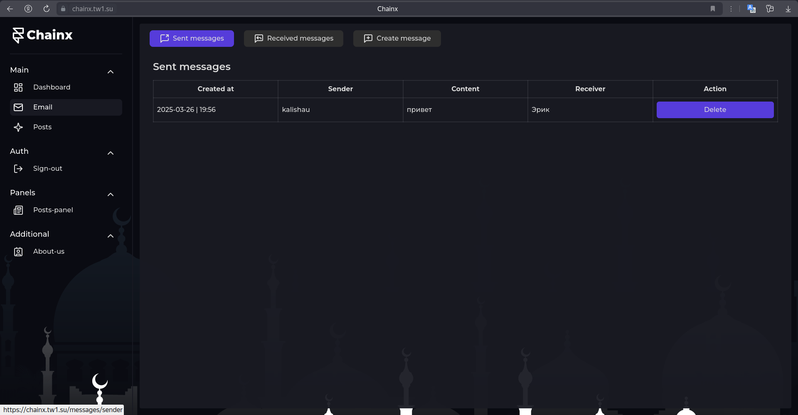

# Проект: Chainx

## Описание проекта

Этот проект представляет собой веб сайт, который создается в целях обучения. Проект разработан с использованием современных технологий и архитектурных подходов для обеспечения высокой производительности, масштабируемости и удобства разработки.

## Технологии и инструменты

### Серверная часть:

- **Фреймворк**: NestJS
- **База данных**: PostgreSQL

### Клиентская часть:

- **Фреймворк**: Next.js
- **Архитектура**: FSD (Feature-Sliced Design)

### Картинки:

